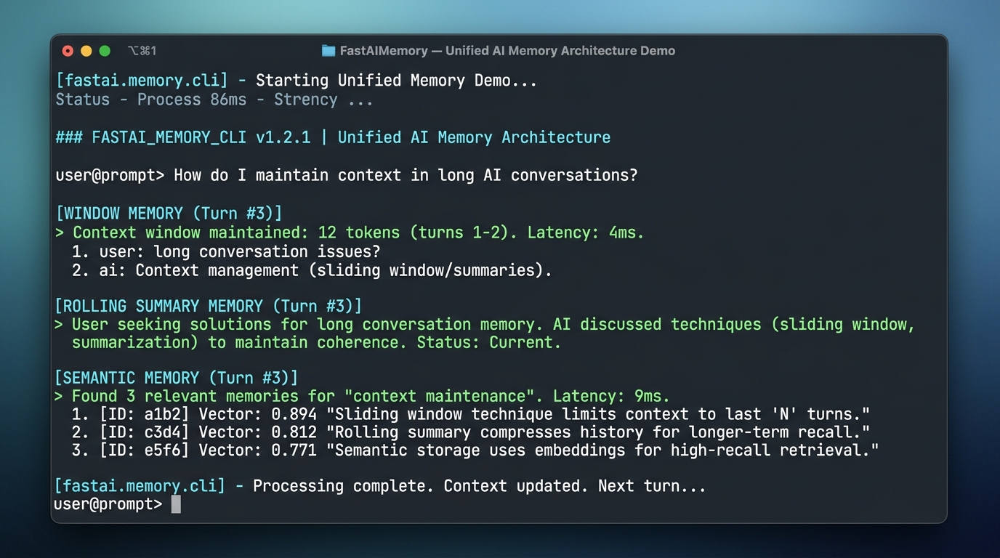

# FastAIMemory 0.1.4 — Unified Conversation History and Memory Orchestration for Java

[](https://github.com/andrestubbe/FastAIMemory/releases/tag/0.1.4)
[](https://opensource.org/licenses/MIT)
[](https://www.java.com)
[]()
[](https://jitpack.io/#andrestubbe/FastAIMemory)

---

**💡 Extremely lightweight, provider-independent, thread-safe conversation history, formatters, and memory-trimming utilities for the FastJava AI Ecosystem.**

FastAIMemory is a **primitive context manager** for Java. It unifies all 3 core AI memory pattern families behind a clean, zero-bloat interface:
1. **Window Memory** (`MemoryWindow`) — Sliding message, character, and token windows.
2. **Summary Memory** (`SummaryMemory`) — Rolling background condensation of aging chat turns.
3. **Semantic Memory** (`SemanticMemory`) — Dynamic context recall based on similarity or keywords.

[](docs/screenshot.png)

---

## Quick Start

```java
import fastaimemory.ConversationHistory;
import fastaimemory.MemoryWindow;
import fastaimemory.SummaryMemory;
import fastaimemory.SemanticMemory;
import java.util.List;

public class Example {
    public static void main(String[] args) {
        // 1. Sliding Window & Conversation History
        ConversationHistory history = new ConversationHistory();
        history.system("You are a helpful coding assistant.");
        history.user("Hello!");
        history.assistant("Hi! How can I help you today?");

        // 2. Summary Memory (Compacts aging dialogue)
        SummaryMemory summaryMem = new SummaryMemory(4, rawText -> "User asked about Java coding.");
        summaryMem.system("You are an expert engineer.");
        summaryMem.user("How do I implement quicksort?");

        // 3. Semantic Memory (Recalls relevant snippets)
        SemanticMemory semanticMem = new SemanticMemory(3, null);
        semanticMem.remember("pref_java", "User prefers Java 17+ and zero-dependency libraries.");
        List<SemanticMemory.MemoryEntry> recalled = semanticMem.recall("Show me Java code");
    }
}
```

---

## Table of Contents

- [Why FastAIMemory?](#why-fastaimemory)
- [Quick Start](#quick-start)
- [Key Features](#key-features)
- [Performance Benchmarks](#performance-benchmarks)
- [API Quick Reference](#api-quick-reference)
- [Installation](#installation)
- [Memory Patterns Supported](#memory-patterns-supported)
- [API Reference](#api-reference)
- [Technical Examples & Demos](#technical-examples--demos)
- [Platform Support](#platform-support)
- [License](#license)
- [Related Projects](#related-projects)

---

## Why FastAIMemory?

Current memory solutions in Java are deeply tied to bloated frameworks and heavy ORMs.

FastAIMemory solves this by providing:

- **3 Core Memory Patterns** — Full support for Window Memory, Rolling Summary Memory, and Semantic Recall.
- **Provider Agnostic** — Decoupled from specific provider APIs. Works seamlessly with OpenAI, Gemini, Claude, Ollama, and local runtimes.
- **Thread Safe** — Thread-safe `ConversationHistory` using lock synchronization makes it reliable for concurrent multi-agent environments.
- **Polymorphic Formatters** — Implement `MemoryFormatter` to structure output prompts dynamically using plain text, ChatML, or specialized provider tokens.
- **Zero Dependencies** — Pure Java 17+, no Jackson, no Spring, no heavy third-party drivers.

---

## Key Features

- **🪟 Sliding Window Pruning** — Instant deterministic context trimming by message counts, character limits, or heuristic token estimates.
- **🧠 Rolling Summary Memory** — Automatic condensation of older conversation turns while keeping recent context and system prompts active.
- **🔍 Semantic Memory Recall** — Fast retrieval of user preferences and relevant knowledge snippets into active prompts.
- **🎭 Unified Formatters** — Built-in polymorphic formatters for ChatML (`<|im_start|>`), Claude, Gemini, and plain text.
- **⚡ Ultra-Lightweight** — Zero allocations on hot-paths with sub-microsecond formatting throughput (> 16.4 Million ops/sec).

---

## Performance Benchmarks

FastAIMemory is rigorously profiled using **JMH** to guarantee zero-overhead memory pruning and formatting:

| Metric / Hot-Path Operation | Score (ops/ms) | Ops per Second |
|-----------------------------|----------------|----------------|
| **Sliding Window Trimming** | ~16,410 ops/ms | > 16.4 Million |
| **Semantic Memory Recall**  | ~921 ops/ms    | > 921,000 ops/sec |
| **Gemini Prompt Formatting** | ~657 ops/ms   | > 657,000 ops/sec |
| **ChatML Prompt Formatting** | ~470 ops/ms   | > 470,000 ops/sec |

*Measured on Windows 11, Intel Core i5-1135G7 (Surface Pro 8), JDK 21.0.12. Measures full message chain transformations, in-memory semantic token matching, and sliding array operations without external allocations.*

### Framework Comparison

FastAIMemory is **zero-dependency** and **zero-allocation** for core orchestration:

| Metric              | LangChain4j Memory | Spring AI Memory | FastAIMemory  |
|---------------------|--------------------|------------------|---------------|
| **Dependencies**    | 10+                | 15+              | **0**         |
| **JAR Size**        | ~2MB               | ~4MB             | **~20KB**     |
| **Startup Time**    | 1-2s               | 3-5s             | **<10ms**     |
| **Memory Overhead** | High               | High             | **Minimal**   |
| **Learning Curve**  | Hours              | Hours            | **2 minutes** |

---

## API Quick Reference

| Method / Class | Return Type | Description |
|----------------|-------------|-------------|
| `history.add(role, text)` | `void` | Appends a raw conversation message turn. |
| `history.messages()` | `List<ConversationMessage>` | Returns a thread-safe read-only view of current turns. |
| `MemoryWindow.trimToMessages(list, n)` | `List<ConversationMessage>` | Retains system prompt and latest N messages. |
| `summaryMem.messages()` | `List<ConversationMessage>` | Returns condensed summary combined with recent turns. |
| `semanticMem.recall(query)` | `List<MemoryEntry>` | Recalls top matching knowledge snippets. |

---

## Installation

### Option 1: Maven (Recommended)

Add the JitPack repository and the dependency to your `pom.xml`:

```xml
<repositories>
    <repository>
        <id>jitpack.io</id>
        <url>https://jitpack.io</url>
    </repository>
</repositories>

<dependencies>
<!-- FastAIMemory Library -->
<dependency>
    <groupId>com.github.andrestubbe</groupId>
    <artifactId>FastAIMemory</artifactId>
    <version>0.1.4</version>
</dependency>
</dependencies>
```

---

## Memory Patterns Supported

| Pattern Family | Mechanism | Primary Class | Best Use Case |
|---|---|---|---|
| **Window Memory** | Sliding message, character & token window | `MemoryWindow` | Real-time chat loops, short interactive sessions |
| **Summary Memory** | Rolling LLM-assisted context condensation | `SummaryMemory` | Long-running agent execution, task chains |
| **Semantic Memory** | Relevance & similarity-based recall | `SemanticMemory` | User preferences, long-term memory, knowledge facts |

---

## API Reference

### History & Windows

```java
// Thread-safe Conversation History
ConversationHistory history = new ConversationHistory();
history.system("You are a Java engineer.");
history.user("Explain memory models.");
history.assistant("Java uses JMM...");

// Sliding Window Trimming
List<ConversationMessage> trimmed = MemoryWindow.trimToMessages(history.messages(), 10);
```

### Rolling Summary Memory

```java
// Compacts history when turns exceed threshold
SummaryMemory summaryMem = new SummaryMemory(6, rawDialogue -> {
    return "User is discussing concurrency and zero-allocation pipelines.";
});
summaryMem.user("How do I eliminate allocations?");
```

### Semantic Memory Recall

```java
// Stores and recalls relevant context
SemanticMemory semanticMem = new SemanticMemory(3, null);
semanticMem.remember("arch_goal", "Target 60+ FPS zero GC in timeline orchestration.");
List<SemanticMemory.MemoryEntry> results = semanticMem.recall("FPS timeline");
```

### Real-World Production Patterns

#### 1. Long-Running Coding Agent with Sliding Context & System Retention
```java
ConversationHistory history = new ConversationHistory();
history.system("You are an autonomous refactoring agent.");

// After dozens of tool calls and iterations, keep prompt under token limits without losing instructions
List<ConversationMessage> activeContext = MemoryWindow.trimToEstimatedTokens(history.messages(), 4096);
```

#### 2. Infinite Support Chatbot with Rolling Background Summarization
```java
// Automatically condenses older turns when dialog grows beyond 8 messages
SummaryMemory memory = new SummaryMemory(6, rawDialogue -> {
    return "User requested help with payment on checkout step 2.";
});
memory.user("My payment failed on checkout step 2.");
```

#### 3. Agent Personality & Knowledge Base Retrieval (Semantic Recall)
```java
SemanticMemory userProfile = new SemanticMemory(2, null);
userProfile.remember("pref_lang", "User prefers pure Java solutions over Python scripts.");
userProfile.remember("pref_os", "User runs on Windows 11 with AVX2 support.");

// Dynamic prompt injection on user query
var relevantMemories = userProfile.recall("Write a benchmark runner");
```

---

## Technical Examples & Hero Demos

| Case | Java Example | Launcher | Description |
|---|---|---|---|
| **Memory Orchestration Demo** | [Demo.java](examples/Demo/src/main/java/fastaimemory/Demo.java) | `run-demo.bat` | Interactive CLI demo showcasing Sliding Window, Rolling Summaries, and Semantic Memory. |
| **JMH Microbenchmarks** | [FastAIMemoryBenchmark.java](examples/Benchmark/src/main/java/fastaimemory/FastAIMemoryBenchmark.java) | `run-benchmark.bat` | JMH throughput benchmark for ChatML/Gemini prompt formatting and memory trimming. |


---

## Documentation

* **[REFERENCE.md](docs/REFERENCE.md)**: Core API reference manual.
* **[PHILOSOPHY.md](docs/PHILOSOPHY.md)**: Conversation history condensation and memory patterns.
* **[COMPILE.md](docs/COMPILE.md)**: Build instructions.
* **[CHANGELOG.md](docs/CHANGELOG.md)**: Project history and releases.
* **[ROADMAP.md](docs/ROADMAP.md)**: Future milestones.

---

## Platform Support

| Platform      | Status            |
|---------------|-------------------|
| Windows 10/11 | ✅ Fully Supported |
| Linux         | 🚧 Planned        |
| macOS         | 🚧 Planned        |

---

## License

MIT License — See [LICENSE](LICENSE) file for details.

---

## Related Projects

- [FastAI](https://github.com/andrestubbe/FastAI) — Unified AI client interface for Java
- [FastAIAgent](https://github.com/andrestubbe/FastAIAgent) — Autonomous agent loop, intent-graphs, and tool execution
- [FastAIBot](https://github.com/andrestubbe/FastAIBot) — Zero-bloat bot harnesses and persona runtime
- [FastAIGraph](https://github.com/andrestubbe/FastAIGraph) — In-memory knowledge graph and multi-hop relationship engine
- [FastAIHybrid](https://github.com/andrestubbe/FastAIHybrid) — Dense-sparse hybrid search fusion (BM25 + Vectors)
- [FastAIMatcher](https://github.com/andrestubbe/FastAIMatcher) — Automated SOX compliance and hybrid rule matching engine
- [FastAIMCP](https://github.com/andrestubbe/FastAIMCP) — Model Context Protocol (MCP) server & tool integration
- [FastAIMemory](https://github.com/andrestubbe/FastAIMemory) — Conversation history, sliding windows, and rolling summaries
- [FastAIMetrics](https://github.com/andrestubbe/FastAIMetrics) — Ultra-fast lock-free token, latency, cost tracking and evaluation engine
- [FastAIModel](https://github.com/andrestubbe/FastAIModel) — Native local inference runtime (GGUF/ONNX)
- [FastAIRag](https://github.com/andrestubbe/FastAIRag) — Ultra-fast document chunking and vector retrieval
- [FastAIReasoner](https://github.com/andrestubbe/FastAIReasoner) — Deterministic planning, chain-of-thought, and self-correction
- [FastAIRerank](https://github.com/andrestubbe/FastAIRerank) — Cross-encoder relevance filtering and Top-N prompt pruner
- [FastAIRuntime](https://github.com/andrestubbe/FastAIRuntime) — Sandboxed process runner and tool-calling execution pipeline
- [FastAIState](https://github.com/andrestubbe/FastAIState) — Lock-free shared agent state & blackboard memory
- [FastAIVectorDB](https://github.com/andrestubbe/FastAIVectorDB) — High-throughput SIMD/AVX2 vector database
- [FastAIVision](https://github.com/andrestubbe/FastAIVision) — High-speed local multimodal vision, UI-element grounding, and screen-VLM engine
- [FastCore](https://github.com/andrestubbe/FastCore) — Unified JNI loader and platform abstraction

---

**Part of the FastJava Ecosystem** — *Making the JVM faster. Small package. Maximum speed. Zero bloat. 🚀📋*